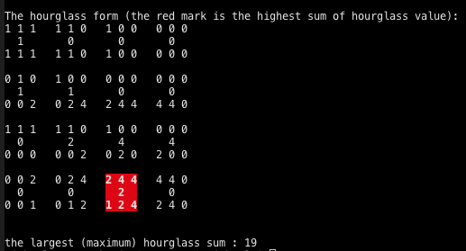

## Problem
Given a *6 X 6* 2D Array, *arr*:
```
1 1 1 0 0 0
0 1 0 0 0 0
1 1 1 0 0 0
0 0 0 0 0 0
0 0 0 0 0 0
0 0 0 0 0 0
```
We define an hourglass in *A* to be a subset of values with indices falling in this pattern in *arr*'s graphical representation:
```
a b c
  d
e f g
```
There are *16* hourglasses in *arr*, and an hourglass sum is the sum of an hourglass' values. Calculate the hourglass sum for every hourglass in *arr*, then print the maximum hourglass sum.  
For example, given the 2D array:
```
arr = [[1, 1, 1, 0, 0, 0], 
       [0, 1, 0, 0, 0, 0], 
       [1, 1, 1, 0, 0, 0], 
       [0, 0, 2, 4, 4, 0], 
       [0, 0, 0, 2, 0, 0], 
       [0, 0, 1, 2, 4, 0]]
```
The hourglass form be like this:
```
1 1 1   1 1 0   1 0 0   0 0 0
  1       0       0       0  
1 1 1   1 1 0   1 0 0   0 0 0

0 1 0   1 0 0   0 0 0   0 0 0
  1       1       0       0  
0 0 2   0 2 4   2 4 4   4 4 0

1 1 1   1 1 0   1 0 0   0 0 0
  0       2       4       4  
0 0 0   0 0 2   0 2 0   2 0 0

0 0 2   0 2 4   2 4 4   4 4 0
  0       0       2       0  
0 0 1   0 1 2   1 2 4   2 4 0
```
We sum each the *16* hourglass values:
```
[7, 4,  2,  0, 
 4, 8, 10,  8, 
 3, 6,  7,  6, 
 3, 9, 19, 14]
```
*19* is the highest sum of hourglass values, which is the *15th* hourgless:
```
2 4 4 
  2     
1 2 4 
```
## Input Format
Each of the *6* lines of inputs *arr[i]* contains *6* space-separated integers *arr[i][j]*.

## Output Format
Print the largest (maximum) hourglass sum found in *arr*.

